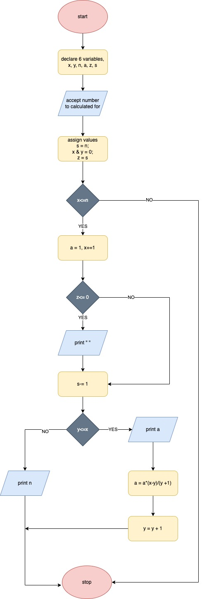

# Pascals triangle 

Pascal’s Triangle is a system of numbers arranged in rows resembling a triangle with each row consisting of the coefficients in the expansion of (a + b)n for n = 0, 1, 2, 3. The construction of the triangular array in Pascal’s triangle is related to the binomial coefficients by Pascal’s rule. 
# Flow chart


## Pseudocode
```python
initialize a nested list of 1
for the range of limit
set a temporary list
append a list of zero to the ends of the list
set a temporary row list to empty
for range of the length of result array
append the sum of the adjacent values
append the row to the result
return result 
```	

## Big O notation
the pascal triangle has O(n^2) time complexity

