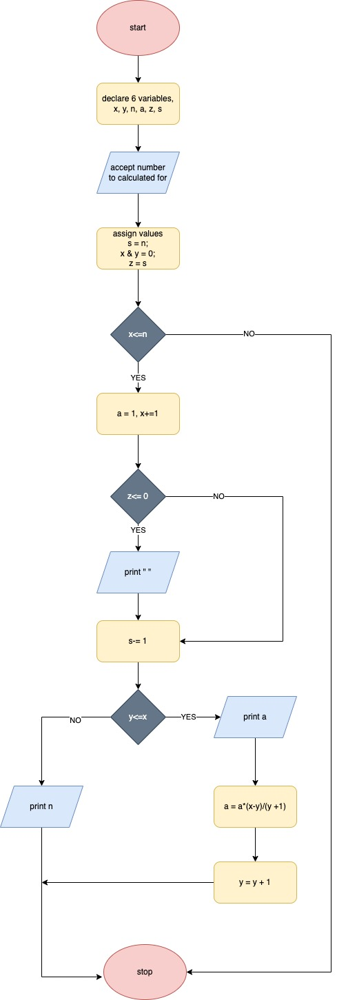

# Pascals triangle 

Pascal’s Triangle is a system of numbers arranged in rows resembling a triangle with each row consisting of the coefficients in the expansion of (a + b)n for n = 0, 1, 2, 3. The construction of the triangular array in Pascal’s triangle is related to the binomial coefficients by Pascal’s rule. 
# Flow chart


## Pseudocode
```
begin
->	declare 6 variables
	x, y, n, a, z, s

->	accept number to be calculated as limit
->	assign values
	s = n
	x = 0
	y = 0
	z = s

-> 	compare x to n
->	if x less than or equal to n
-> 		assign a = 1
->		x++
-> 		compare z to 0
->		if z less than or equal to n
->			print space
->			s--1
-> 		else
->			s--1
-> 		compare y to x
-> 		if y less than or equal to x
->			print a
->			a = a * (x - y) / (y + 1)
->			y = y + 1
->		else
->			print n
->	else
->		stop
```	

